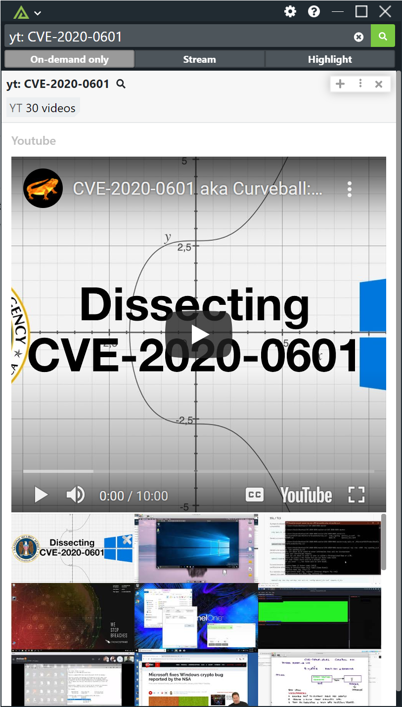
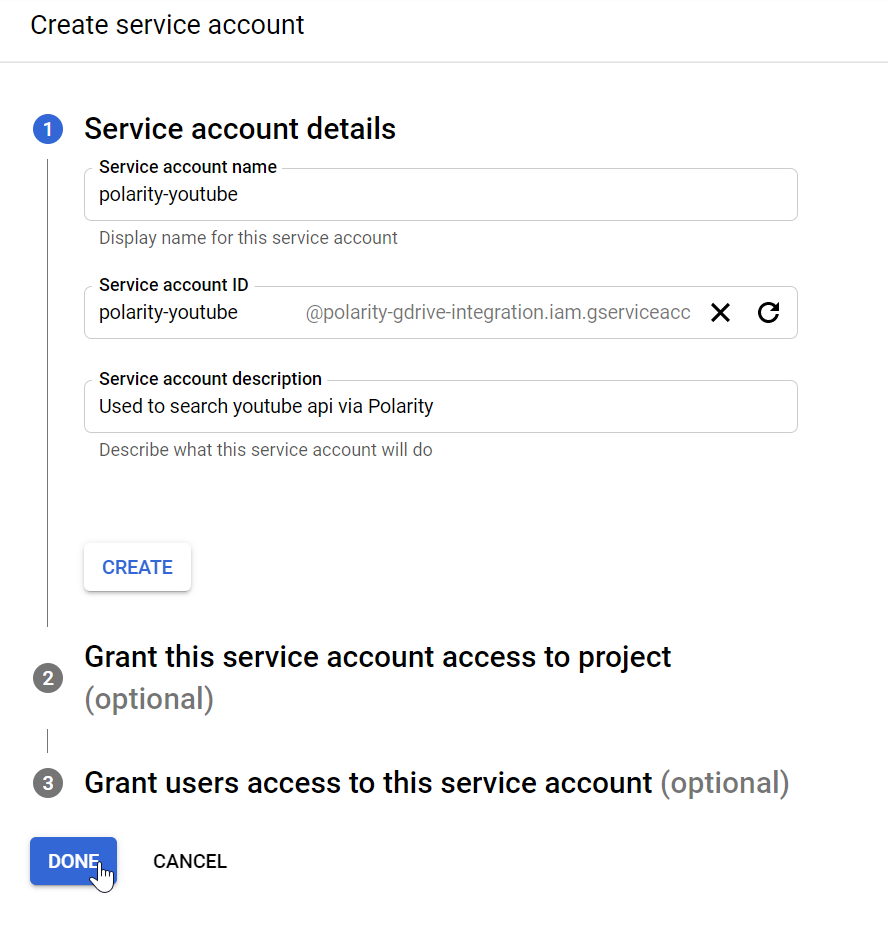
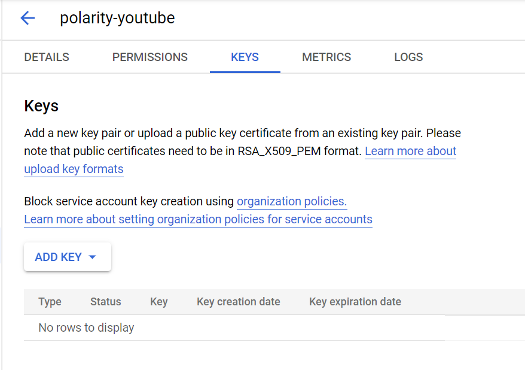
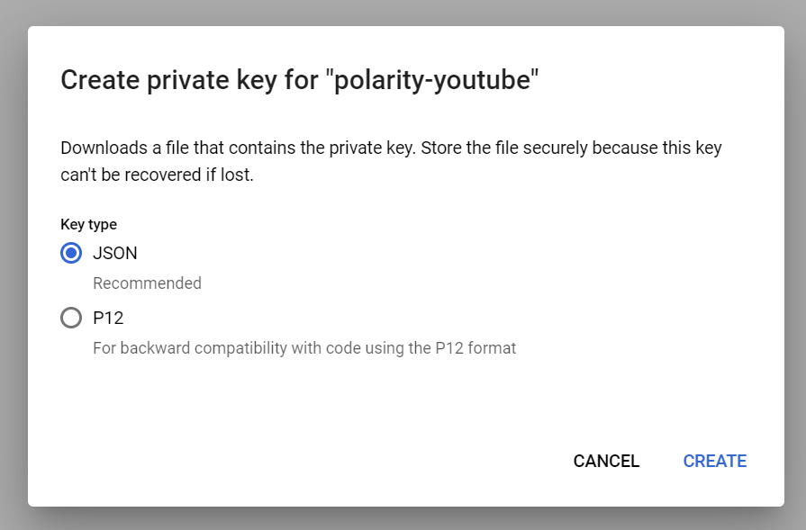
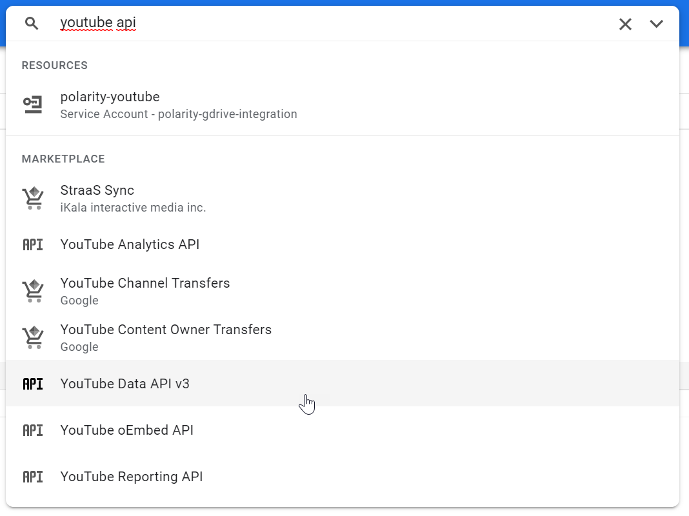
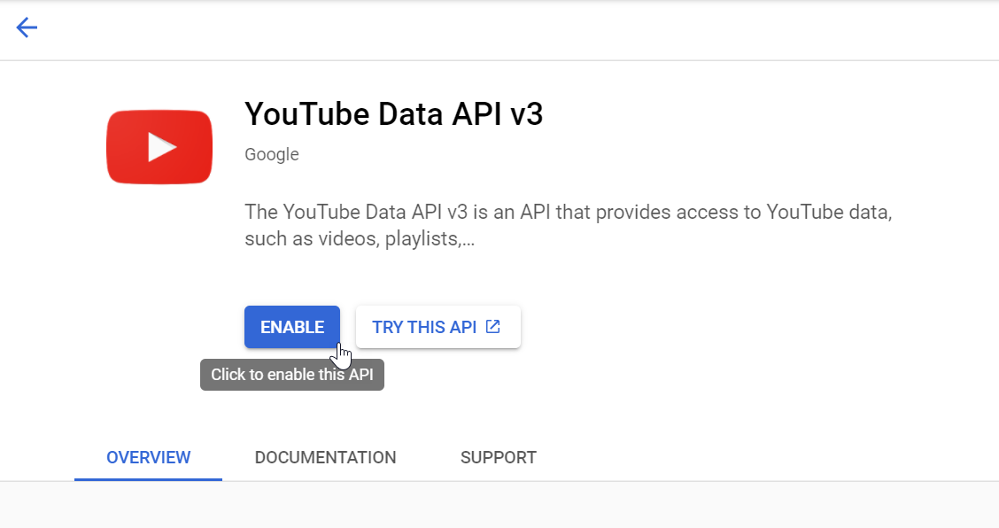

# Polarity Youtube Integration


Polarity's youtube integration gives users the ability to search for and view youtube videos.  In the search bar type `yt:` followed by your search term.  The integration will return the 30 most relevant videos.

> The youtube integration is on-demand only and can be triggered by prepending your search string with `yt:`.  For example, to search for videos on CVE-2020-0796 you could type `yt: CVE-2020-0796` into the search bar.



## Installation Instructions

Installation instructions for integrations are provided on the [PolarityIO GitHub Page](https://polarityio.github.io/).

## Configuring the Integration

You will need to configure a Google service account key and perform the following steps.

### Create the Project and Service Account

Before you can use the Polarity Youtube Integration you will need to go to the [Google Developers Console](https://console.developers.google.com/) and create a new project. Provide a name for your project and an ID, which can be generated as well.

After the project has been created, from the left menu, select `Credentials`, then `Create credentials`. Select `Service account key` from the type of credentials list. After this, choose `New service account` from the dropdown and name the service account `polarity-youtube`.  Under the role selection, choose `Service Accounts -> Service Account User`.  



### Create JSON Key

After the service account is created you will need to navigate to the service and click on the `KEYS` tab.  



From there click on the JSON key option



### Enable the API

Next we need to enable the API which will be used with this service account. To do that, use the search input at the top of the screen and search for “Youtube API”.  Select  `Youtube Data API v3`.



On the Youtube API screen click on the Enable API button



### Transfer Service Account Key to Polarity server

SSH into the Polarity Server as root and navigate to the Youtube integration subdirectory:

```
cd /app/polarity-server/integrations/youtube/
```

Create a new directory named `key` and upload the service account key created in Step 1 above, or optionally copy the contents of the key file into a new file named `privatekey.json`.  After the key file has uploaded or created, make the `key` directory and its contents owned by the polarityd user:

```
chown -R polarityd:polarityd /app/polarity-server/integrations/youtube/key/
```

> PLEASE NOTE: If the key file is not explicitly named `privatekey.json` or is placed in an alternate location, the integration configuration file (config.js) needs to be modified to reflect this change.

```
auth:{
    // Path to youtube private key file
    key: './key/privatekey.json'
}
```

## About Polarity

Polarity is a memory-augmentation platform that improves and accelerates analyst decision making.  For more information about the Polarity platform please see:

https://polarity.io/
